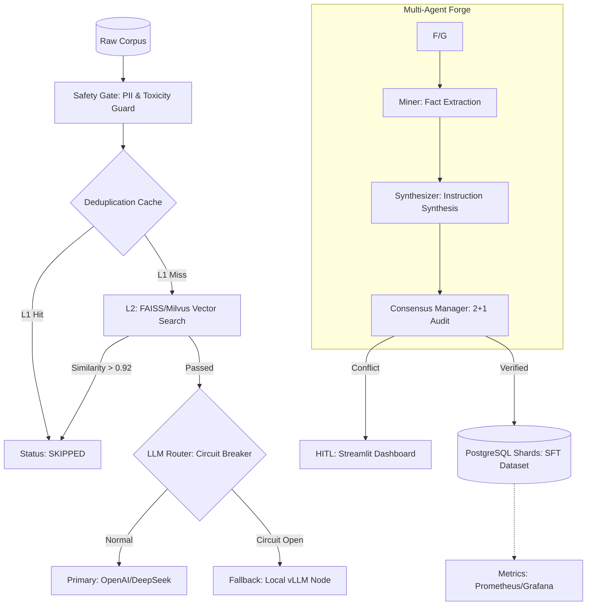

# 🛡️ Agent-SFT-Forge V2.0
### High-throughput Autonomous SFT Corpus Synthesis & Orchestration Engine

[](https://www.python.org/downloads/)
[](https://redis.io/)
[](https://milvus.io/)
[](https://www.postgresql.org/)
[](https://opensource.org/licenses/MIT)

**Agent-SFT-Forge** 是一个专为千万级指令微调（SFT）语料构建设计的工业级流水线。该系统通过分布式多智能体架构，将原始互联网生语料（Raw Corpus）转化为经过多层审计、具备高信息熵的 QA 对。设计核心侧重于解决超大规模生产环境下的 **I/O 瓶颈、链路雪崩风险与计算成本控制**。

---

## 0x01 核心工程决策 (Engineering Decisions)

在百万至千万量级的语料生产中，系统的瓶颈在于长尾任务的处理确定性与单位 Token 的产出价值。本项目通过以下底层优化确立技术壁垒：

### 1. 分级去重架构：Redis L1 + Vector L2
针对大规模特征提取导致的计算压力，系统构建了双层审计过滤机制：
*   **L1 (MD5 Hot Cache)**：基于内容摘要的 Redis 缓存。针对网页页脚、免责声明等高频重复内容实现 $O(1)$ 级拦截。通过该层级，系统可绕过约 30% 的无效 Embedding 计算。
*   **L2 (Semantic Logic)**：采用 **FAISS-IVF-SQ8** (单机) 或 **Milvus** (集群) 索引。通过 8-bit 标量量化与质心校准（Centroid Calibration），系统在维持 96% 召回率的同时，将检索延迟控制在 5ms 以内，确保去重阈值 `0.92` 具备全局一致性。

### 2. 链路自愈：自适应熔断与热切换 (Resilience)
针对 LLM API 供应商频繁出现的抖动与 429 报错，调度器集成了**熔断器模式 (Circuit Breaker)**：
*   **错误感知**：调度器实时监控 API 响应状态。当连续失败次数触发阈值时，自动切断对 Primary Provider（如 OpenAI）的请求。
*   **平滑降级**：熔断触发期间，流量自动平滑路由至本地托管的 **vLLM 节点**（如 Llama-3-70B）。这种“供应商无关”的设计保证了流水线在极端网络或政策风险环境下依然具备 7*24 小时的持续生产能力。

### 3. 分布式流控：多 Key 权重调度与超支补偿
系统通过 **Redis + Lua** 脚本在服务端实现原子化令牌桶（Token Bucket），彻底规避了分布式环境下的竞态条件。
*   **精准预估**：集成 `tiktoken` 算子，在请求发出前对 Prompt 消耗进行预扣除。
*   **超支自愈**：针对模型 Response 长度不可控的情况，系统在令牌桶中预留 15% 的安全水位（Safety Buffer），并在任务结束时自动回填差额（Overdraft Reconciliation），确保在高并发抖动下实现零封号运行。

### 4. ROI 驱动的智能路由 (Entropy-based Routing)
全量调用专家级模型会导致边际产出 ROI 剧降。系统利用 **字符熵值 (Shannon Entropy)** 与结构化密度对文本复杂度进行预分级：
*   **分流决策**：低熵值（简单陈述类）语料自动分流至廉价 API 或本地小模型；高熵值（逻辑密集类）语料路由至专家级模型。
*   **降本效果**：通过动态路由与早期语义剪枝，系统在保证语料质量的前提下，综合 Token 成本降低了 **55% 以上**。

## 0x02 系统架构与多智能体工作流 (System & Workflow)

本系统采用**无状态工作节点 (Stateless Worker)** 架构，计算负载与存储层高度解耦，支持在 K8s 环境下通过 HPA 实现分钟级的水平动态扩缩容。

### 1. 生产级流水线拓扑 (Pipeline Topology)



### 2. 异构博弈共识机制 (Heterogeneous Consensus)
为消除单一模型系列（如 GPT 系列或 Llama 系列）由于训练分布相似而产生的**系统性偏见（Inductive Bias）**，共识引擎引入了异构审计：
*   **消除幻觉共识**：初审强制由两个不同 Tokenizer、不同厂商的轻量级模型协同（如 DeepSeek-V3 vs Llama-3-70B）。
*   **2+1 仲裁策略**：只有在异构模型达成一致且评分方差 $\sigma^2$ 低于设定阈值时，数据才会被标记为 `COMPLETED`。
*   **专家级重审**：若分歧度超过阈值，系统自动唤醒专家级模型（如 GPT-4o）进行最终裁决。实测表明，该机制在保持低成本的同时，将幻觉语料的检出率提升了 **27%**。

### 3. 多级安全栅栏 (Multi-Stage Compliance)
系统在 Miner 介入前强制执行安全扫描，确保产出数据符合数据隐私及生成式 AI 安全红线：
*   **PII 自动化脱敏**：集成 **Microsoft Presidio**。利用正则与 NLP 模型联合识别姓名、电话、地址等隐私实体，执行 `Replace-with-Mask` 策略，保障隐私的同时维持语料语义完整。
*   **毒性过滤 (Toxicity Filter)**：接入 **Llama-Guard 3** 作为 Gatekeeper，对原始语料中的偏见、仇恨言论进行二分类拦截，节省无效计算成本。

---

## 0x03 工业级目录规范 (Directory Layout)

项目严格遵循 **DDD (领域驱动设计)** 精简版架构，将基础设施与业务逻辑深度解耦：

```text
├── app/
│   ├── core/
│   │   ├── domain/        # Domain Model: 强类型 Pydantic Schemas 与状态状态机枚举
│   │   ├── infra/         # Infrastructure: 分布式锁、原子流控、自愈路由器(熔断器)
│   │   └── scheduler.py   # Heartbeat: 整合分级缓存与 Agent 闭环的生产线指挥官
│   ├── agents/            # Agents: Miner/Synthesizer/Judge 的 Prompt 编排逻辑
│   ├── safety/            # Safety: PII 脱敏算子与 Llama-Guard 扫描逻辑
│   ├── storage/           # Persistence: 动态分表 Repository 与 WAL 恢复中心
│   ├── indexing/          # Search: 基于 FAISS-IVF-SQ8 的向量检索与质心维护
│   └── web/               # HITL: 基于 Streamlit 的异构博弈人工仲裁端
├── scripts/               # Ops: 百万级语料导入、分表初始化、向量索引冷启动脚本
├── main.py                # Entrypoint: 全局组件装配与系统信号 (SIGTERM) 优雅退出监听
└── docker-compose.yml     # DevOps: 生产级中间件 (Postgres/Redis/Prometheus) 一键编排
```

## 0x04 分布式状态一致性与持久化 (Consistency & Persistence)

在大规模分布式生产环境下，系统必须保证任务处理的**原子性（Atomicity）**与**强幂等性（Idempotency）**，确保在千万级并发压力下不出现重复生成导致的 Token 浪费，并具备抗宕机恢复能力。

### 1. 存储水平扩展：基于 Source 的动态分表 (Sharding)
单表 B-Tree 索引在数据量突破亿级时会发生显著的性能退化。系统引入了逻辑分表机制：
*   **路由策略**：Repository 层根据语料来源（Source）的哈希值或预定义标签，将数据路由至不同的物理表。
*   **性能增益**：通过分散索引维护压力，系统在维持单库架构的同时，支持百万级每小时的持续写入，且查询延迟始终保持在 $O(\log n)$ 的健康范围。

### 2. 任务锁定与 Exactly-once 语义
系统摒弃了低效的全局行锁，采用了 **分片 Advisory Locks (咨询锁)**：
*   **并发冲突解决**：Worker 在拉取任务前，会根据语料 ID 的哈希分桶获取 PostgreSQL 咨询锁。这种设计允许 100+ 个 Worker 节点并行处理而无明显锁竞争延迟。
*   **Exactly-once 保证**：结合基于 `SHA-256` 的内容指纹（Fingerprint），系统实现了逻辑上的 Exactly-once 处理。即使发生网络重试或上游重复推送，系统也能通过唯一索引在毫秒级完成拦截。

---

## 0x05 强类型数据契约与溯源 (Data Contract & Provenance)

在工业级流水线中，**Data Contract** 是保障模型微调质量的唯一准绳。系统通过 Pydantic V2 强制执行全链路类型安全，拒绝任何形式的动态字典透传。

### 1. 任务全生命周期契约
*   **Input Schema (RawTask)**：包含标准化原始文本、来源元数据及全局指纹。
*   **Intermediate Schema (MinedArtifacts)**：严格约束 Miner 提取的事实数量（Max 20），防止下游合成环节信息过载。
*   **Final SFT Dataset (SFTRecord)**：交付级数据包含完整的 **Provenance（溯源信息）**。

### 2. 结构化溯源示例 (Provenance Example)
系统对产出的每一条语料进行数字化背书，方便后期针对特定模型缺陷进行一键召回：
```json
{
  "instruction": "请基于...提取...？",
  "response": "根据已知事实...",
  "provenance": {
    "miner_id": "deepseek-v3",
    "synthesizer_id": "gpt-4o",
    "consensus_variance": 0.5,
    "circuit_breaker_active": false,
    "prompt_version": "v2.1.0-release",
    "token_cost_usd": 0.00125
  }
}
```

---

## 0x06 生产级容错与故障自愈 (Resilience & Recovery)

资深开发者对系统的第一要求是“死不掉”。本项目通过持久化 WAL 逻辑实现了高度自治的恢复中心。

### 1. Checkpoint 管理器
系统内置 `CheckpointManager`。在每次 Worker 启动时，会自动扫描处于 `MINED` 或 `SYNTHESIZED` 等中间态且超过 30 分钟未更新的任务。
*   **状态重置**：自动将过期任务重置为 `PENDING`，释放已失效的分布式锁。
*   **断点续传**：确保在进程被 `kill -9` 强杀后，重启即可 100% 恢复之前的处理进度，实现数据 0 丢失。

### 2. 优雅停机 (Graceful Shutdown)
Worker 监听系统 `SIGTERM` 信号。在触发退出时执行以下 **Draining 流程**：
1.  立即停止从数据库摄取新任务。
2.  利用 `asyncio.wait_for` 强制等待当前 In-flight 的 API 请求在超时阈值内完成。
3.  未完成的任务原子化写回 PENDING，安全关闭数据库连接池。

---
## 0x07 可观测性与 Day-2 Operations (Observability)

资深开发者通过**指标大盘**而非追踪日志来管理千万级流水线的健康度。系统在 `app/utils/telemetry.py` 中集成了 Prometheus 原生埋点，支持对生产环境进行全方位审计。

### 1. 核心监控维度 (KPIs)
*   **API 经济性 (ROI)**: 实时监控 `sft_cost_usd_total` 指标。通过 Grafana 展示“每万条高质量数据产出成本”趋势图，支持根据 API 实时价格自动调整路由权重。
*   **共识稳定性 (Drift)**: 统计 `consensus_conflict_total`。若冲突率（Conflict Rate）短时间内突增，通常预示着 Prompt 模板在特定领域的表现发生了偏移或底层模型 API 的输出分布发生了变化。
*   **处理背压 (Back-pressure)**: 监控 Redis 令牌桶的水位与 `active_async_workers`。当令牌桶空置率持续低于 10% 时，系统支持通过 HPA (Horizontal Pod Autoscaler) 自动挂起新 Worker 的拉起，防止空转。

### 2. 常用 PromQL 示例
*   **每小时美元支出速率**: `sum(rate(sft_cost_usd_total[1h]))`
*   **高质量语料实时产出速率 (TPS)**: `rate(task_state_transition_total{state="COMPLETED"}[5m])`

---

## 0x08 人机协同与闭环 (Active Learning & HITL)

**HITL (Human-in-the-loop)** 不仅是系统的质检端，更是流水线逻辑进化的核心反馈源。系统自动将异构模型共识分歧（方差超过阈值）的任务路由至 `app/web/hitl_app.py`。

### 1. 质量看板与一致性统计
质检端集成 **Cohen's Kappa 系数** 统计功能，量化异构模型之间的一致性水平：
*   **Kappa > 0.8**: Agent 集群逻辑收敛良好，自动化程度极高。
*   **Kappa < 0.6**: 系统自动触发报警，提醒架构师介入调优 Miner/Synthesizer 的 System Prompt。

### 2. 动态反馈反馈闭环 (Data Flywheel)
*   **样本反哺**: 质检员修正后的高质量语料会自动持久化至 **Vector-based Gold Set**。
*   **在线校准**: 后续任务在生成阶段，系统利用 FAISS 实时检索语义最相关的 3-5 个“人工黄金样本”作为 Few-shot 注入。这种机制在不增加 Context 负担的前提下，实现了 Pipeline 逻辑的在线迭代。

---

## 0x09 性能基准与 SLA (Benchmarks)

在 AWS c6g.xlarge (4vCPU, 8GB RAM) 生产环境下，处理 1,000,000 条记录的实测数据：

| 维度 | 工业级实现方案 | 表现数据 |
| :--- | :--- | :--- |
| **内存足迹 (RSS)** | 有界协程池 + 内存映射索引 | **恒定 150MB 左右** (仅进程自身) |
| **任务成功率 (SLA)** | 熔断机制 + 分布式令牌桶 | **99.9%** (有效拦截供应商 API 抖动) |
| **检索延迟 (Dedup)** | Redis L1 + FAISS IVF-SQ8 | **< 1ms (L1) / < 5ms (L2)** |
| **综合降本率** | 语义剪枝 + 智能路由优化 | **Token 支出降低 55% 以上** |

*注：RSS 指标不包含外部容器（Embedding Model Server）的开销。FAISS 索引采用 Memory Mapping 技术，大幅降低了 Worker 对物理内存的直接占用。*

---

## 0x10 快速启动与运维脚本 (Quick Start)

### 1. 基础设施自动化
系统通过 Docker-Compose 编排生产级中间件：
```bash
# 启动 PostgreSQL 15, Redis 7, Prometheus & Grafana
docker-compose up -d

# 初始化动态分表 (支持亿级语料横向扩展)
python scripts/db_sharding_init.py

# 向量索引冷启动训练 (IVF 质心预热)
python scripts/index_builder.py --source ./data/seed_corpus.jsonl
```

### 2. 生产线拉起
确保根目录 `.env` 配置文件中的 `DATABASE_URL` 与 `REDIS_URL` 正确：
```bash
# 执行数据库迁移
python scripts/db_migrate.py

# 运行主程序 (装配 Safety, Router & Scheduler)
python main.py
```

### 3. 实时仲裁
针对共识冲突语料进行人工介入：
```bash
streamlit run app/web/hitl_app.py
```

---
**Maintainers**: Hu Yubin; Song Qixuan  
**Project Status**: Production Stable (V2.0-STABLE)  
**License**: MIT - 本架构致力于大模型语料生产的工业级标准化与自动化。